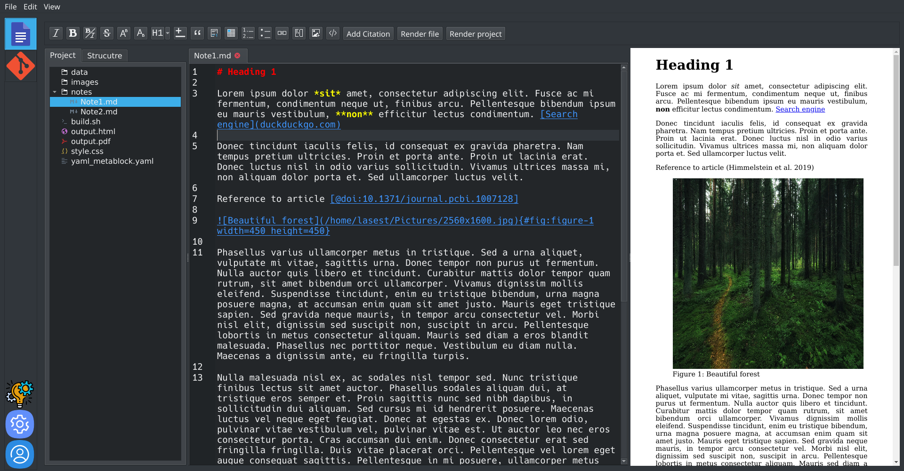

# ManuWrite - a manuscript editor for scholarly writing

**NOTICE:** Manuwrite is still in the very early phase of development. Some features have not been implemented yet and some major bugs may be present. No backward compatability is guaranteed. Please be careful when using the program and take adequate precautions to ensure the safety of your manuscripts.



## What is Manuwrite?

Manuwrite is a text editor designed specifically for writing scientific texts using Markdown. It provides an intuitive graphical user interface which allows the users to write the text of the manuscript without the need to bother themselves with any of the technical details of how the manuscript will be prossessed in the future to produce the output.

Manuwrite's main purpose is to make modern open source document processing tools such as Pandoc and Manubot accessible to a wider audience of users, not familiar with the command line. Manuwrite prioritizes ease of use and tries to do everyting possible to free the researchers writing the manuscripts from the need to learn above mentioned technologies, while trying to provide them with the benefits of using such technologies.

## Manuwrite features

- All text formatting can be done through GUI - the user is not required to have expertise in Markdown or any of the technologies involved in producing the manuscript.

- Manuwrite provides a gui to Git and GitLab, which allows the user to fully utilize modern version control and collaboration tools without the need to ever use the command line.

- A set of reasonable default settings is provided, which would produce beautiful manuscripts wihtouth any further configuration

- Manuwrite is very flexible and configurable. The user has full access to command line commands that are executed behing the scenes and can edit them to suit their needs.

## How to run

1. Install dependencies: python 3, git, pandoc, pandoc-cite.

2. Clone the repo:

```git clone https://github.com/lasest/manuwrite.git```

3. Run ```build.sh```. It will create the virtual environment, install necessary python modules and convert *.ui files to *.py. After that the program will be run.

